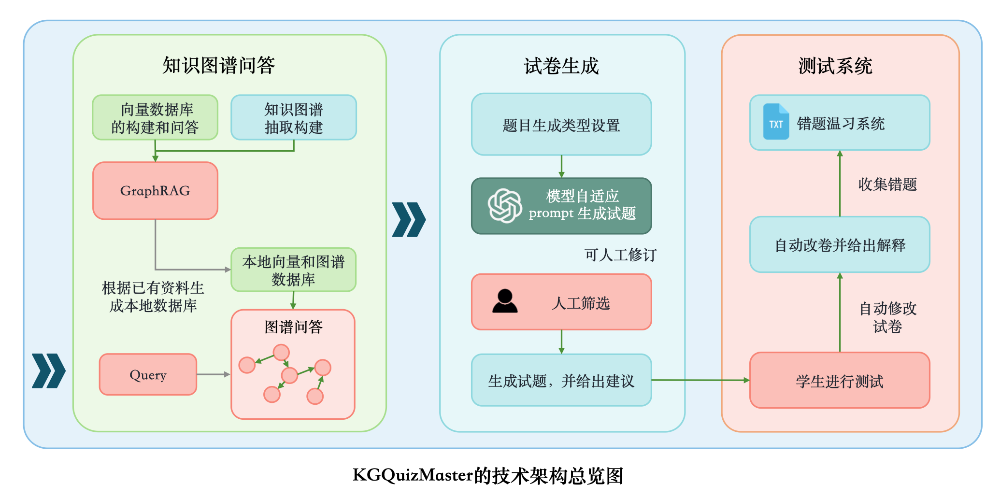
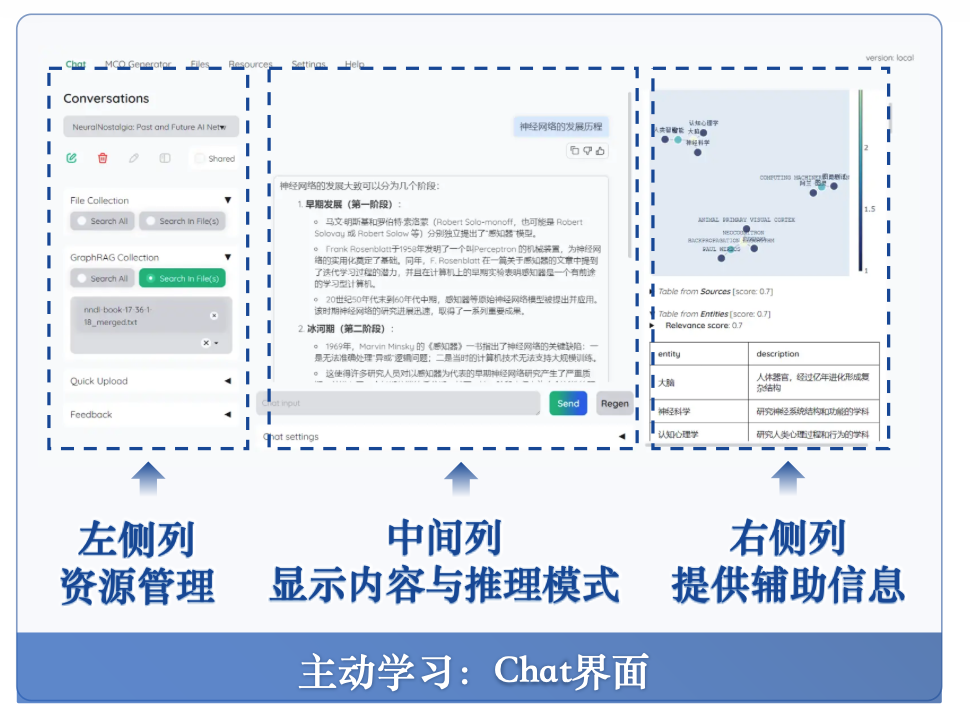
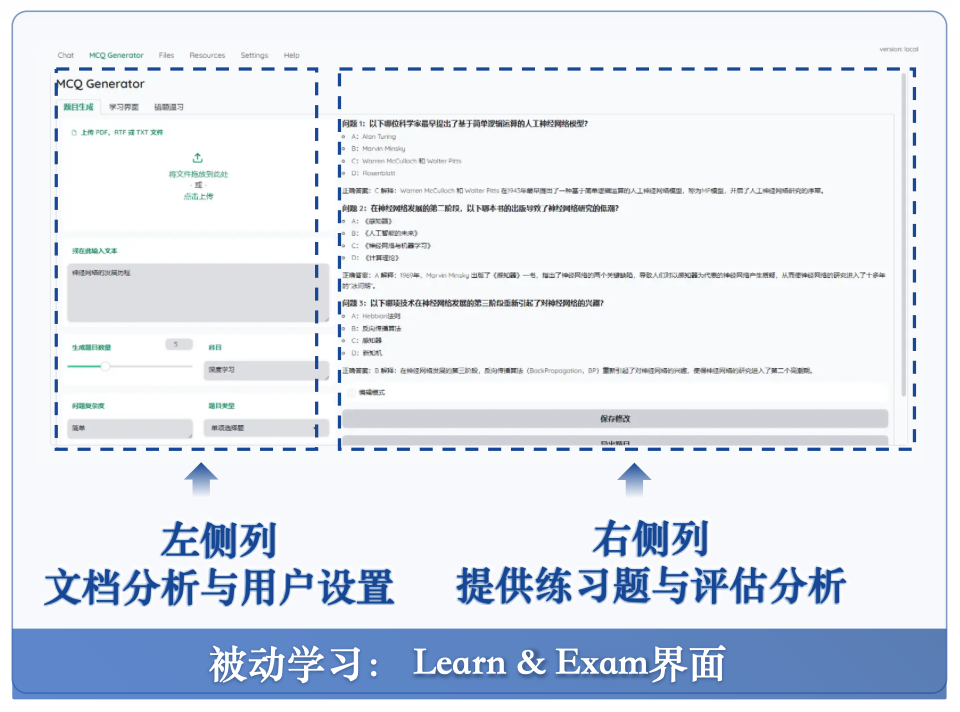
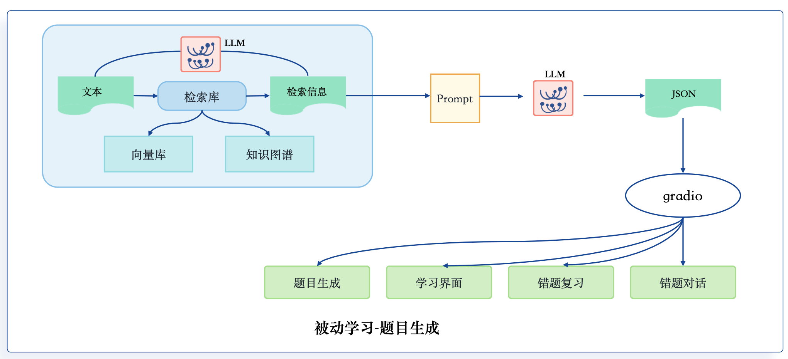
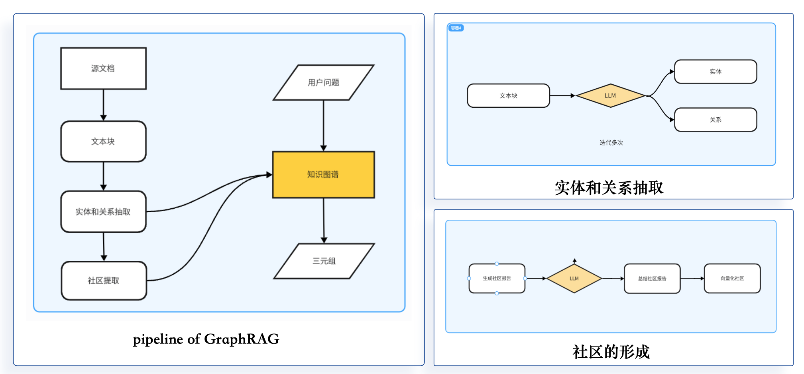
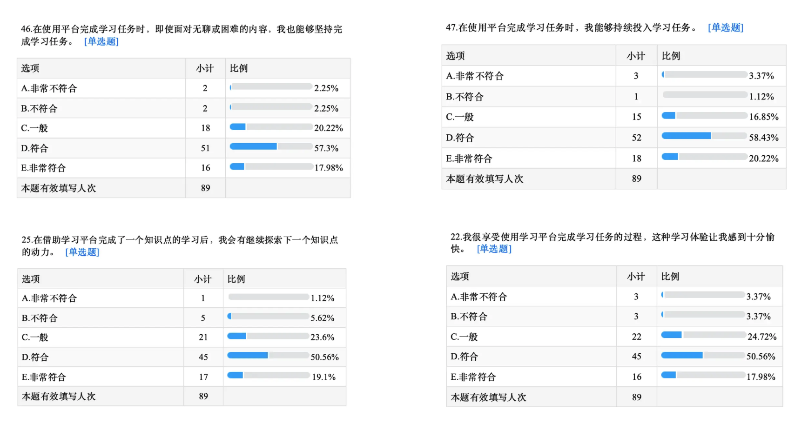
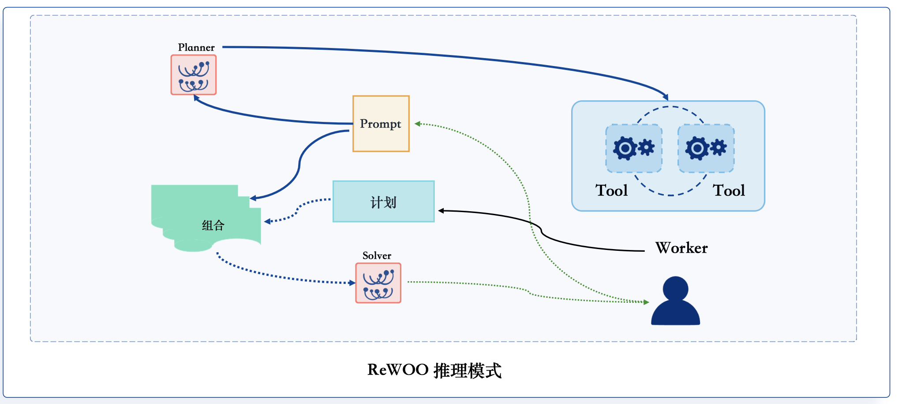

# AI-EDU

## 文档

 基于 kotaemon 改进的的智能教育考试系统

[](https://python.org)
[](LICENSE.txt)

基于 kotaemon 的智能教育考试系统，集成了基于 AI Agent 的智能题目生成和个性化问答功能。

## 特性亮点

- 基于 AI Agent 的智能题目生成
- 智能错题分析和个性化学习建议
- 自适应学习路径规划
- 基于历史错题的智能对话
- 灵活的题目修改和优化建议

## 系统架构

### Agent 系统架构


## 快速开始

### 环境要求
- Python 3.10+
- Docker (可选)

### 安装步骤

1. 克隆仓库
```bash
git clone [repository-url]
cd ai_edu_exam
```

2. 安装依赖
```bash
pip install -r doc_env_reqs.txt
```

3. 启动应用
```bash
python app.py
```


## 使用指南

### 考试场景



### 题目生成


### 题目修改


### 修改建议


### 错题分析系统


## 技术栈

- 框架：kotaemon
- AI 引擎：LLM, Embedding
- 数据存储：JSON, Chroma
- 容器化：Docker
