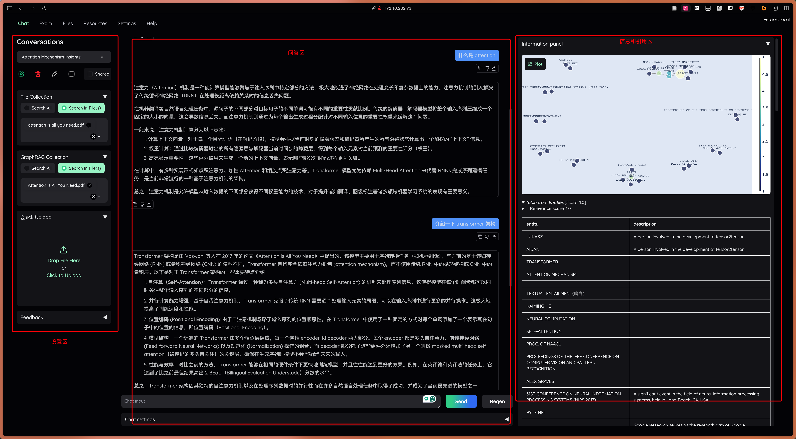
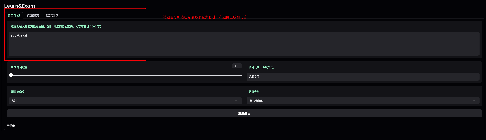
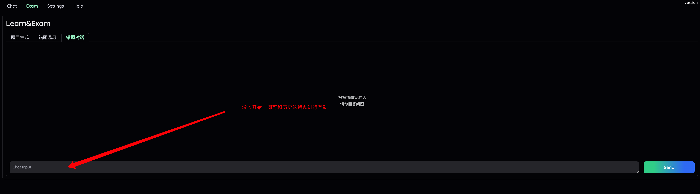

KGQuizMaster 使用手册

主要分为两部分功能，chat和exam, chat为问答功能，exam为生成题目自测功能。

## 初始账号

```
若为exp组，则为："exp" + "学号"，密码为 名字 + "pP="
若为con组，则为："con" + "学号"，密码为 名字 + "pP="
```

## 1.  Chat 界面

在 Chat 模式中，KGQuizMaster 可以回答用户提出的问题，并根据上传的材料生成知识图谱和向量库，通过图检索和向量检索生成准确答案。


主要功能

	1. 图谱问答
	•	Collection：使用本地已向量化或知识图谱化的文件。
	• 右侧会显示答案的来源和涉及到的相关实体内容和关系
	2. 对话模式设置：支持多种推理模式，用户可根据问题的复杂程度选择以下推理方式：
	•	Simple：直接回答。
	•	Complex：将问题分解为子问题，逐一解答。
	•	ReAct：适合逐步推理的问题。
	•	ReWOO：引入“规划者”和“执行者”角色，分工合作解决问题。
	3.	信息佐证：信息面板提供模型生成回答时的佐证信息，包括知识图谱、三元组数据和向量相似度检索的文本等，方便用户追踪答案来源。

## 2.  Exam 界面

KGQuizMaster 可以根据上传的教学材料生成相关练习题，帮助用户复习和巩固知识。



主要功能

	1.	生成题目：支持上传多种格式的教学资料（如教科书、PDF文档、TXT文本），或直接输入主题。系统会基于材料生成包含知识点的练习题。
	2.	题目定制：支持用户设置题目的数量、学科、复杂度和题型。系统根据用户设置智能生成匹配的题目，满足个性化需求。
	3.	题目评估和编辑：每次生成题目后，系统会评估题目质量并提供修改建议，用户可根据反馈编辑题目和答案，实现个性化定制。



	4.	错题重温：系统会自动记录用户的错题，并生成错题集。用户可重新练习错题并向系统提出疑问，系统会尝试解答。
	5.	题目导出：支持用户将生成的题目导出为 JSON 文件，以便保存、整理或分享。

KGQuizMaster 通过这些功能，为用户提供一站式的问答和学习体验，提升学习效果和效率。